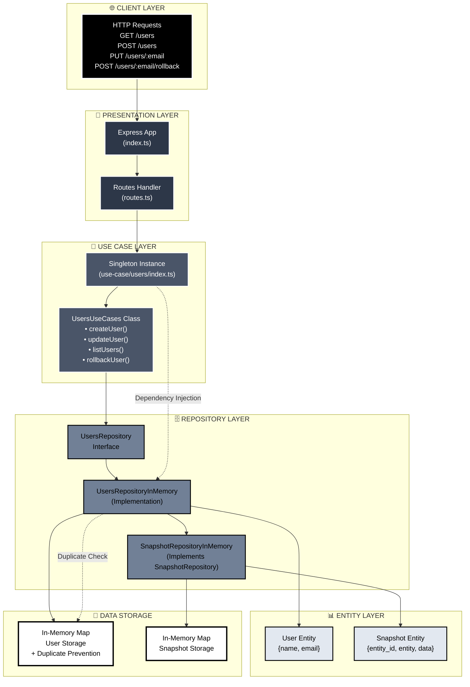

Com a popularização do uso de agentes de IA e com o advento de novas interfaces de interação homem-máquina, como por exemplo, o protocolo MCP, tem ficado cada vez mais claro que novas estratégias e garantias precisam existir para permitir que nossos sistemas possam acompanhar essa mudança sem desmoronar esse intrincado castelo de cartas.
Quando se tem contato com sistemas de alto throughput e escala, fica muito mais fácil ver um pequeno acidente de percurso se tornar um verdadeiro desastre.
Imagine o seguinte cenário: 

> Você trabalha com um marketplace que possui um recurso de API que permite editar dados de produtos, o que é bem comum em um sistema dessa natureza. Um usuário deste sistema decide usar a nova interface que vocês disponibilizaram, que permite que com algumas instruções de texto, esse cliente possa editar dados dos produtos que ele tem no catálogo pessoal do marketplace. Porém, a edição da descrição fica toda incorreta, e o pior, afeta 1000 produtos do catálogo desse cliente... EM PRODUÇÃO 😨

Certamente este cliente vai abrir um ticket para o suporte dizendo: 
> "Eu não sei o que aconteceu, mas o sistema bagunçou todo meu catálogo" 

E após verificar os logs, você e seu time descobrem que na verdade o usuário interagiu com essa nova funcionalidade que consumiu tools do MCP server que vocês disponibilizaram, e essas tools permitiam a atualização do catálogo de forma indiscriminada.

E agora? Supondo que seu time de Ops é muito bom, e vocês mantém snapshots frequentes do banco de dados, vocês precisarão alocar algumas horas para subir um clone do snapshot anterior à mudança e escrever alguns scripts para reconciliar esses dados com o banco em produção (o que geralmente cria um certo nível de tensão e risco).
Vocês podem inclusive, desenvolverem mecanismos pra inibir o poder das tools, e permitir conjuntos mais restritos de mudanças entre essas interações.

Tudo isso é válido, mas e se houvesse uma forma do próprio cliente reverter essa operação?

Com esse cenário em mente, fiz alguns experimentos e gostaria de compartilhar com vocês uma versão simplificada pra ilustrar como poderíamos mitigar esse tipo de problema.

Considerando que estamos falando da arquitetura Rest para ser a interface do nosso sistema, uma alternativa seria nos aproveitarmos da sua capacidade semântica, e para os recursos críticos (como no caso do catálogo de produtos do exemplo acima) disponibilizar o `rollback` do recurso.
Dessa forma, ao implementar um MCP server, por exemplo, a tool de operação teria seu par de `rollback`.

No exemplo simplificado que comentei, fiz uma API que possui a entidade `User` que contém `email` e `name` apenas, e permite salvar e editar um usuário, e a entidade `Snapshot` que possui `entity`, `entity_id` e `data` que cuidará de manter a versão anterior de uma entidade. 

Veja como ficou a arquitetura do projeto de exemplo:



Se observar, o mecanismo de snapshot é incorporado ao mecanismo de manipulação de dados (na camada de armazenamento) e ativamente é invocado para "fotografar" o estado anterior da informação. Se olhar o código mais de perto, verá como isso foi feito:
```js
class UsersRepositoryInMemory implements UsersRepository {
  private users: Map<string, User> = new Map();
  private snapshotRepository: SnapshotRepository = new SnapshotRepositoryInMemoryImpl();
  private _ENTITY = 'user';

  list(): User[] {
    logger.info({users:Array.from(this.users.values())},`Listing users`);
    return Array.from(this.users.values());
  }

  update(user: User): void {
    const previousState = this.users.get(user.email);

    logger.info({user},`Updating user`);

    this.snapshotRepository.store({
      entity_id: user.email,
      entity: this._ENTITY,
      data: JSON.stringify(previousState)
    });

    this.users.set(user.email, user);
  }

  store(user: User): void {
    if (!this.users.get(user.email)) {
      logger.info({user},`Storing user`);
      this.users.set(user.email, user);
    }
  }

  rollback(email: string): void {
    const previousState = this.snapshotRepository.findByEntity(this._ENTITY, email);
    if (previousState) {
      logger.info({previousState},`Rolling back user`);
      this.users.set(email, JSON.parse(previousState.data));
      this.snapshotRepository.delete(previousState.entity_id);
    }
  }

}
```

Neste projeto de exemplo, implementei o armazenamento em memória para ambas as entidades, mas em um cenário real, as entidades relacionadas ao negócio costumam ser armazenadas em bancos relacionais (seguindo ainda a proposição de ser um marketplace), e a entidade de `Snapshot` acredito que faria sentido ser armazenada em um sistema de armazenamento mais versátil, como por exemplo, um banco baseado em documentos.

Acredito ainda que em um cenário real, o ideal é utilizar um sistema de eventos para a criação dos snapshots, e manter o processamento da regra de negócio o mais leve possível (considerando alta escala). É claro, tudo depende seu caso de uso.

Porém, a ideia persiste. Toda vez que um recurso for atualizado, tiramos uma "fotografia" do estado antes da atualização e mantemos ela por um período de tempo para permitir a reversão ao estado anterior.

Isso vai garantir que se executarmos a seguinte sequência de operações:

Criar o usuário José
```
curl -H 'Content-Type: application/json' -d '{"name":"José", "email":"jose@email.com"}' -X POST http://localhost:8000/users
```

Editar o nome do usuário José
```
curl -H 'Content-Type: application/json' -d '{"name":"José Filho", "email":"jose@email.com"}' -X PUT http://localhost:8000/users/jose@email.com
```

Executar o rollback
```
curl -H 'Content-Type: application/json' -X POST http://localhost:8000/users/jose@email.com/rollback
```

Listar os usuários
```
curl http://localhost:8000/users
```

Teremos como resultado: `[{"name":"José","email":"jose@email.com"}]`.

Você já teve que lidar com uma situação similar? Se sim, como você resolveu esse tipo de problema?

Um forte abraço e bons estudos!
