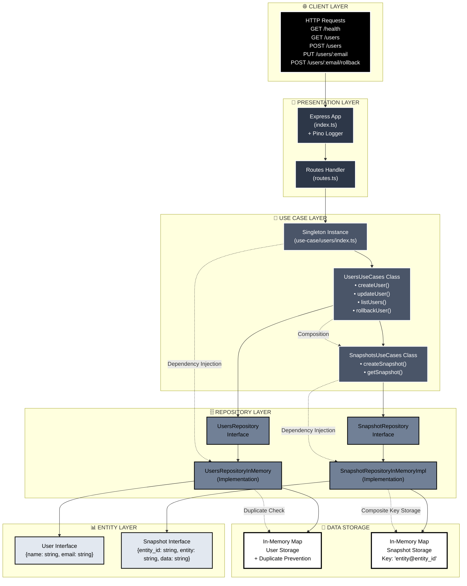

# Implementation of a "rollback machine" pattern to enable reverting changes

## How to play it

Run `yarn dev` or `npm run dev`.

Now, you can play around. For example:

**Create an user**
```
curl -H 'Content-Type: application/json' -d '{"name":"José", "email":"jose@email.com"}' -X POST http://localhost:8000/users
```

**Edit his name**
Editar o nome do usuário José
```
curl -H 'Content-Type: application/json' -d '{"name":"José Filho", "email":"jose@email.com"}' -X PUT http://localhost:8000/users/jose@email.com
```

**Run the rollback**
```
curl -H 'Content-Type: application/json' -X POST http://localhost:8000/users/jose@email.com/rollback
```
**List the users, and you'll see the user having the initial name (before the update)**
```
curl http://localhost:8000/users
```

## Architecture



No código ficou assim:

```js
class UsersUseCases {
  private snapshotsUseCases: SnapshotsUseCases;
  private _ENTITY = 'user';

  constructor(private readonly usersRepository: UsersRepository) {
    this.snapshotsUseCases = new SnapshotsUseCases(new SnapshotRepositoryInMemoryImpl());
  }

  createUser(user: User) {
    this.usersRepository.store(user);
  }

  updateUser(user: User) {
    const currentState = this.usersRepository.findByEmail(user.email);

    if (currentState) {
      this.snapshotsUseCases.createSnapshot({
        entity: this._ENTITY,
        entity_id: user.email,
        data: JSON.stringify(currentState)
      });
    }

    this.usersRepository.update(user);
  }

  listUsers() {
    return this.usersRepository.list();
  }

  rollbackUser(email: string) {
    const previousState = this.snapshotsUseCases.getSnapshot(this._ENTITY, email);
    if (previousState) {
      const user = JSON.parse(previousState.data) as User;
      this.updateUser(user);
    }
  }
}
```
