# Implementation of a "rollback machine" pattern to enable reverting changes

## How to play it

Run `yarn dev` or `npm run dev`.

Now, you can play around. For example:

**Create an user**
```
curl -H 'Content-Type: application/json' -d '{"name":"José", "email":"jose@email.com"}' -X POST http://localhost:8000/users
```

**Edit his name**
Editar o nome do usuário José
```
curl -H 'Content-Type: application/json' -d '{"name":"José Filho", "email":"jose@email.com"}' -X PUT http://localhost:8000/users/jose@email.com
```

**Run the rollback**
```
curl -H 'Content-Type: application/json' -X POST http://localhost:8000/users/jose@email.com/rollback
```
**List the users, and you'll see the user having the initial name (before the update)**
```
curl http://localhost:8000/users
```

## Architecture

```mermaid
graph TB
    %% Client Layer
    subgraph CLIENT ["🌐 CLIENT LAYER"]
        HTTP["HTTP Requests<br/>GET /users<br/>POST /users<br/>PUT /users/:email<br/>POST /users/:email/rollback"]
    end

    %% Presentation Layer
    subgraph PRESENTATION ["📡 PRESENTATION LAYER"]
        APP["Express App<br/>(index.ts)"]
        ROUTES["Routes Handler<br/>(routes.ts)"]
    end

    %% Use Case Layer (Refactored)
    subgraph USECASE ["🎯 USE CASE LAYER"]
        USERSUSECASES["UsersUseCases Class<br/>• createUser()<br/>• updateUser()<br/>• listUsers()<br/>• rollbackUser()"]
        USECASEINSTANCE["Singleton Instance<br/>(use-case/users/index.ts)"]
    end

    %% Repository Layer
    subgraph REPOSITORY ["🗄️ REPOSITORY LAYER"]
        USERREPOINTF["UsersRepository<br/>Interface"]
        USERREPO["UsersRepositoryInMemory<br/>(Implementation)"]
        SNAPREPO["SnapshotRepositoryInMemory<br/>(Implements SnapshotRepository)"]
    end

    %% Entity Layer
    subgraph ENTITY ["📊 ENTITY LAYER"]
        USER["User Entity<br/>{name, email}"]
        SNAPSHOT["Snapshot Entity<br/>{entity_id, entity, data}"]
    end

    %% Data Storage
    subgraph STORAGE ["💾 DATA STORAGE"]
        USERMAP["In-Memory Map<br/>User Storage<br/>+ Duplicate Prevention"]
        SNAPMAP["In-Memory Map<br/>Snapshot Storage"]
    end

    %% Communication Flow
    HTTP --> APP
    APP --> ROUTES
    
    ROUTES --> USECASEINSTANCE
    USECASEINSTANCE --> USERSUSECASES
    
    USERSUSECASES --> USERREPOINTF
    USERREPOINTF --> USERREPO

    USERREPO --> SNAPREPO
    USERREPO --> USER
    SNAPREPO --> SNAPSHOT

    USERREPO --> USERMAP
    SNAPREPO --> SNAPMAP

    %% Dependency Injection
    USECASEINSTANCE -.->|"Dependency Injection"| USERREPO

    %% Enhanced Features
    USERREPO -.->|"Duplicate Check"| USERMAP

    %% Styling for high contrast
    classDef clientStyle fill:#000000,stroke:#ffffff,stroke-width:3px,color:#ffffff
    classDef presentationStyle fill:#2d3748,stroke:#ffffff,stroke-width:2px,color:#ffffff
    classDef usecaseStyle fill:#4a5568,stroke:#ffffff,stroke-width:2px,color:#ffffff
    classDef repositoryStyle fill:#718096,stroke:#000000,stroke-width:2px,color:#000000
    classDef entityStyle fill:#e2e8f0,stroke:#000000,stroke-width:2px,color:#000000
    classDef storageStyle fill:#ffffff,stroke:#000000,stroke-width:3px,color:#000000

    class HTTP clientStyle
    class APP,ROUTES presentationStyle
    class USERSUSECASES,USECASEINSTANCE usecaseStyle
    class USERREPOINTF,USERREPO,SNAPREPO repositoryStyle
    class USER,SNAPSHOT entityStyle
    class USERMAP,SNAPMAP storageStyle
```

